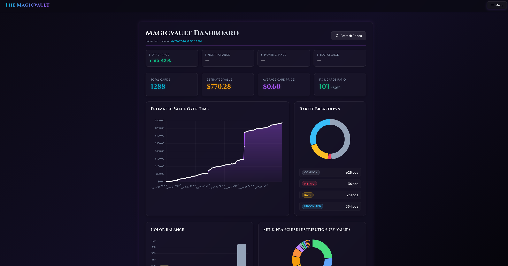
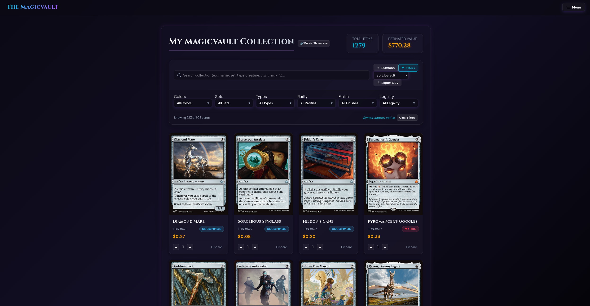
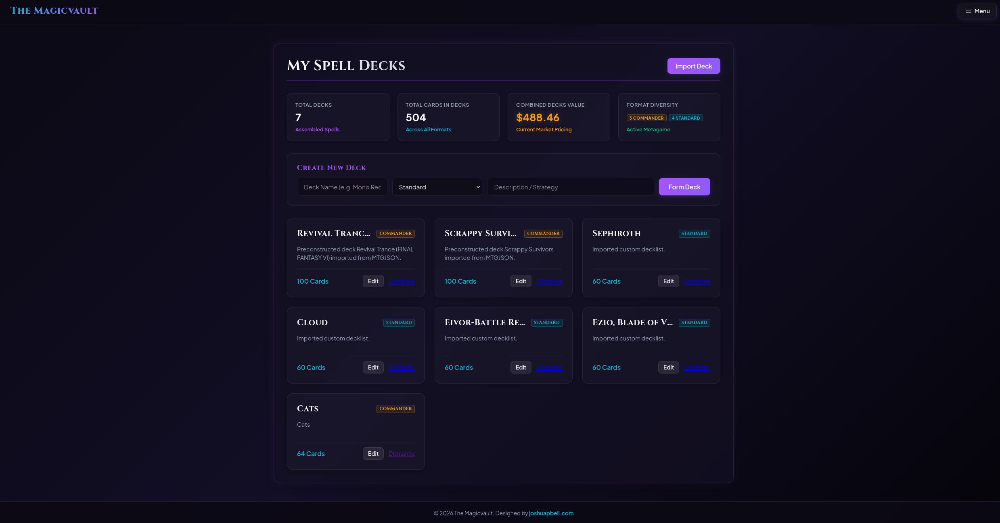
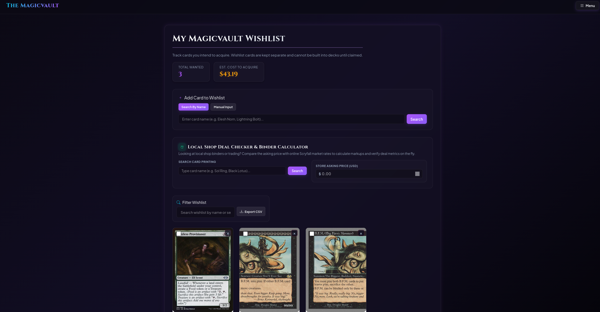
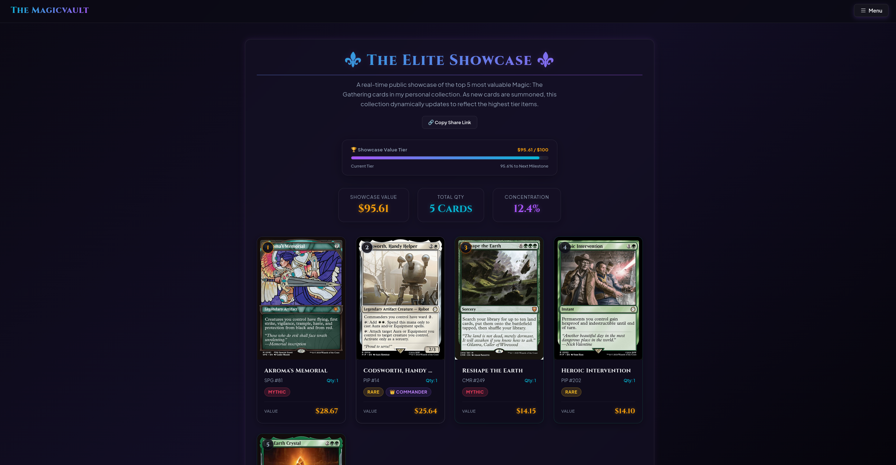

# 🔮 The Magicvault

**The Magicvault** is a premium, feature-rich web application for cataloging Magic: The Gathering collections, building decks, tracking battlefield tokens/art cards, analyzing deck demographics, and simulating playtest starting hands.

Designed with a sleek, responsive dark glassmorphism user interface and backed by a lightweight SQLite database, The Magicvault integrates directly with the **Scryfall API** for card detail resolution/pricing and **MTGJSON** for official preconstructed deck data.



---

## ⚡ Key Features

### 1. 🗂️ Collection Inventory Tracker
* **Card Summoning**: Add cards using Set Code and Collector Number, fetching pricing, artwork, mana costs, and colors instantly.
* **Foil Options**: Separate tracking for standard and Foil printings with set-specific pricing.
* **Estimated Value & Analytics**: Tracks unique items and dynamic USD value of the collection over time using price snapshots.
* **Robust Advanced Search**: Scryfall-like search filters. Type syntax queries (e.g. `type:creature`, `color:w`, `cmc>=5`, `is:foil`, `is:commander`) or general keywords (e.g. `rare instant`) to filter collection instantly client-side.



### 2. 🛡️ Deck Builder & Legality Verifier
* **Collection-Limited Building**: Restricts deck composition to cards physically in your collection. Tells you how many copies are available vs. currently committed.
* **Format Legality Check**: Queries Scryfall to verify deck legality (Standard, Modern, Commander, Pioneer, Legacy, Pauper, Vintage). Banned or illegal cards cannot be added.
* **Basic Land Summoner**: Instantly summon basic lands (Plains, Island, Swamp, Mountain, Forest) in bulk. It automatically adds the lands to your collection with a $0.00 price tag to preserve collection financial statistics.



### 3. 📥 Preconstructed & Custom Deck Importers
* **MTGJSON Precon Database**: Search from over **2,700+** official preconstructed decks (Commander precons, Challenger decks, early theme decks) from MTG history. Rebuilds and imports the deck with a single click.
* **Custom Text Decklist Parser**: Paste standard formats (e.g., `1 Sol Ring` or `1x Elesh Norn`) to import them.
* **Bulk Scryfall Resolution**: Resolves cards in chunks of 75 using Scryfall's bulk POST `/cards/collection` endpoint, processing full 100-card decks in seconds.
* **Collection Synchronization**: Automatically adds imported deck cards to your physical collection database or increases quantities to cover the deck's requirements.

### 4. 🪙 Token & Art Card Trackers
* **战场 Token Tracker**: Summons and catalogs physical tokens by Set Code and Collector Number.
* **🎨 Art Series Tracker**: Tracks MTG Art Series collectibles.
* **Advanced Query Resolution**: Dynamically maps parent sets to token/art sets (e.g., searching `WOE #15` resolves `TWOE #15` *Monster // Sorcerer* token and `AWOE #15` *Spiteful Hexmage* art card) and prioritizes set identifiers. Includes double-faced face-specific image fallback checks.

### 5. 📊 Deck Analytics & Playtest Simulator
* **Curve & Pips Chart**: Displays a vertical bar chart of spell CMC curve and counts colored mana symbols (`{W}`, `{U}`, etc.).
* **Type Breakdown**: Proportional progress bars indicating Creatures, Lands, Instants, Sorceries, Artifacts, Enchantments, and Planeswalkers.
* **Playtest Simulator**: Shuffles the deck and draws a starting hand of 7 cards. Features a functional **Mulligan** button (draws one card fewer recursively) and a **Reset** button to start over.

### 6. 📝 Wishlist Tracker & LGS Deal Checker
* **Isolate Wanted Cards**: Cards in your wishlist are stored separately from your active library. You cannot add them to decks until they are officially claimed.
* **Acquisition Estimates**: The wishlist header automatically sums up the total wanted quantities and computes the estimated USD price to purchase them.
* **LGS Deal Checker Cockpit**: In the Wishlist page's deal checker, view live total owned/needed counts, compare local asking prices to calculate markup/discount metrics, and check compatibility with custom decks.



### 7. ⚜️ Elite Showcase & Public Sharing
* **Showcase Directory**: A public directory (`/showcases`) listing all collectors' showcases ranked by total value, showing top card art, total collection value, card counts, and approved comment counts.
* **Automated Rankings**: Showcase pages (`/showcase/<username>`) dynamically highlight your top 5 Vintage cards and top 10 Modern cards.
* **XP Milestone Bar**: Visual progress bar tracking total value towards collecting targets ($100, $500, etc.).
* **3D Tilt & Foil Shimmer**: Interactive hover tilt animations and detailed overlay stats modal queried from Scryfall.
* **Showcase Comments**: Allows registered users and anonymous guest visitors to comment on showcases.
* **Guest Comment Moderation & Alert system**: Guest comments require site admin approval before appearing. The site admin (first registered user) gets active indicators (pulsing Menu button alerts, count badges in the nav dropdown, and directory card badges) whenever guest comments are pending. A dedicated panel on showcase pages allows one-click Approve/Reject actions.



### 8. 📷 Asynchronous Rapid-Fire Card Scanner & Updater
* **Card Scanner Modal**: Accessible directly from the Summon drawer, letting you scan cards using your webcam or photo upload.
* **Smart OCR Title Cropping**: Captures the card title area using a horizontal guide box. Cuts off the right 32% of the bar to exclude mana cost symbols, and automatically inverts colors for dark-background cards (like Black cards and Planeswalkers) so Tesseract OCR always gets dark text on a light background.
* **Rapid-Succession Summoning**: Add Normal and Foil printings in quick succession using background fetch requests. The camera remains active, and page reloading is deferred until you close the modal.
* **Manual Input Fallback**: Pre-fills the search input field with the detected OCR text, allowing you to edit minor typos and hit Enter without retyping the entire card name.
* **One-Click Codebase Updater**: Automatically queries the GitHub Releases API. Displays an "Update Available" notification badge in the navigation bar and allows updating the entire local codebase to the latest release version directly from the Settings page.

---

## 🛠️ Tech Stack
* **Backend**: Flask (Python 3)
* **ORM / Database**: SQLAlchemy (SQLite)
* **Migrations**: Flask-Migrate (Alembic)
* **API Integrations**: Scryfall REST API, MTGJSON file server
* **Frontend**: HTML5, Vanilla JavaScript, CSS Custom Properties (Sleek glassmorphism theme)

---

## 🚀 Setup & Run Instructions

### 1. Prerequisite Checklist
* Python 3.8 or higher installed on your system.
* Active internet connection (required for MTGJSON lists and Scryfall card queries).

### 2. Environment Installation
Clone or navigate to the workspace directory, then configure a virtual environment:

**On Linux / macOS:**
```bash
# Create a virtual environment named 'venv'
python3 -m venv venv

# Activate the virtual environment
source venv/bin/activate

# Install all required Python packages
pip install -r requirements.txt
```

**On Windows:**
```cmd
# Create a virtual environment named 'venv'
python -m venv venv

# Activate the virtual environment (Command Prompt)
venv\Scripts\activate
# Or in PowerShell:
.\venv\Scripts\Activate.ps1

# Install all required Python packages
pip install -r requirements.txt
```

### 3. Database Initialization
Prepare the SQLite database schema by upgrading it to the latest migration head:
```bash
# Apply database migration revisions
flask db upgrade
```

### 4. Running the Server
Launch the Flask development server:
```bash
# Run using Flask command line
flask run

# OR run directly via python
python3 app.py
```
Open your browser and navigate to `http://127.0.0.1:5000` to start managing your library!

### 5. Vault Authentication (Default Passcode)
To protect your inventory database, the application requires a passcode at login.
* **Default Passcode**: `magicvault`
* **Customizing the Passcode**:
  - **In-App Settings**: Navigate to the **Settings** panel to change your vault passcode.
  - **Environment Variable**: Set the `APP_PASSWORD` environment variable before running:
    ```bash
    export APP_PASSWORD="your_custom_passcode"
    ```
  - **Local File Override**: You can write a passcode to a `passcode.txt` file in the project's root directory (gitignored). For security, the app automatically hashes and replaces any plain-text passcode written to this file with a secure cryptographic hash.

---

## 📁 File Structure
```
├── app.py                  # Main Flask application, routes, models, and API helpers
├── requirements.txt        # Python package dependencies and version requirements
├── mtg_collection.db       # SQLite local database (generated at database upgrade)
├── migrations/             # Database migration version files (Alembic/Flask-Migrate)
└── templates/              # Jinja2 HTML templates
    ├── base.html           # Main document shell, custom styling, and global navbar
    ├── index.html          # Collection inventory view and card summoner panel
    ├── detail.html         # Individual card details and collection specs
    ├── decks.html          # Deck list dashboard and simple creation form
    ├── deck_detail.html    # Deck builder editor, curve analytics, and hand simulator
    ├── decks_import.html   # Precon database search and text copy-paste importers
    ├── tokens.html         # Token inventory tracker view
    ├── art_cards.html      # Art series collector tracking view
    ├── dashboard.html      # Global collection valuation charts and leaderboards
    └── releases.html       # Application version release notes
```

---

## 👤 Created By
* **Joshua Bell** - [joshuapbell.com](https://joshuapbell.com)
